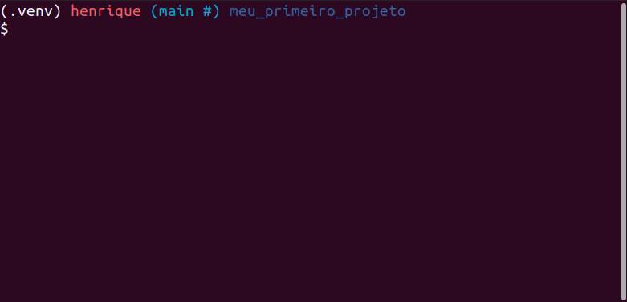

[](https://github.com/HenriqueAJNB/data-science-escalavel/tree/main/book)


## Como estruturar seu projeto de ciência de dados para aumentar a legibilidade e transparência

<div style="text-align: justify">

### Motivação

É importante estruturar o seu projeto de ciência de dados baseado em algum padrão determinado, de modo que seus colegas de trabalho consigam facilmente manter e modificar o projeto.


Mas qual tipo de padrão deve ser seguido? Não seria ideal se pudéssemos criar uma estrutura a partir de um modelo padrão (template)?

Existem alguns excelentes templates para projetos de ciência de dados, mas neles há uma insuficiência de algumas boas práticas de como testes, configurações e formatação do código.

Por este motivo, a autora original do livro, Khuyen Tran, criou um repositório chamado [data-science-template](https://github.com/khuyentran1401/data-science-template/blob/master/README.md). Este repositório é resultado de anos de sua experiência  refinando as melhores práicas para estruturar um projeto, deixando-o com maior reprodutibilidade e manutenabilidade.

Nesta seção, iremos aprender a usar esse template para incporporar as melhores práticas ao fluxo de ciência de dados.

### Mão na massa!

Para fazer download do template, comece instalando o [cookiecutter](https://github.com/cookiecutter/cookiecutter):

```bash
pip install cookiecutter
```

Crie um projeto baseado no template:

```bash
cookiecutter https://github.com/khuyentran1401/data-science-template
```

..., e então será solicitado a fornecer alguns detalhes do seu projeto, como:
- Nome
- Autor
- Versão compatível do Python


Neste momento, um projeto com o nome especificado acima será criado, e ele possuirá a seguinte estrutura:


As ferramentas utilizadas nesse template são:

- [Poetry](https://python-poetry.org/): gerenciamento de pacotes e ambientes virtuais.
- [hydra](https://hydra.cc/docs/intro/): gerenciamento de arquivos de configuração.
- plugins do [pre-commit](https://pre-commit.com/): automação na formatação e revisão do código.
- [DVC](https://dvc.org/): versionamento de dados e experimentos.
- [pdoc](https://pdoc.dev/): criação de documentação automática para a API do seu projeto.

Nas próximas seções, iremos aprender as funcionalidades destas ferramentas e arquivos.

### Dependências e ambiente virtual

Este projeto usa o [Poetry](https://python-poetry.org/) no lugar do `pip` para gerenciar as dependências, já que ele nos permite:

- Separar as dependências principais das indiretas em dois arquivos distintos, ao invés de armazená-las todas em um único arquivo `requirements.txt`.
- Criar arquivos de dependência mais legíveis.
- Remover todas as dependências indiretas não utilizadas ao remover um pacote.
- Evitar instalar novos pacotes que são conflitantes com os pré-existentes.
- Empacotar o projeto em diversas linhas de código.

As instruções de instalação do Poetry está neste [link](https://python-poetry.org/docs/#installation). Todas as dependências principais do projeto estão definidas no arquivo `pyproject.toml`. Para instalar todas as dependências, basta rodar no terminal:

```bash
poetry install
```

Para adicionar um novo pacote do repositório PyPI, rode:

```bash
poetry add <nome-do-pacote>
```

Para remover um pacote:

```bash
poetry remove <nome-do-pacote>
```

---
**Comentário do tradutor:**

Como o Poetry lida com problema de otimização quando está resolvendo as dependências, ele pode ser mais lento do que o `pip`, dependendo da quantidade de pacotes. 

A própria documentação oficial do Poetry reconhece esta deficiência, veja [neste link aqui](https://python-poetry.org/docs/faq/). 

Além disso, há vários issues abertos referente ao tema de lentidão do Poetry:
- [Poetry is extremely slow when resolving the dependencies #2094](https://github.com/python-poetry/poetry/issues/2094)
- [Dependency resolution is extremely slow #4924](https://github.com/python-poetry/poetry/issues/4924)

Se caso for necessário um build mais veloz, sugiro não utilizar o Poetry.

---

### Makefile

O arquivo Makefile nos permite criar atalhos pequenos e legíveis para uma série de comandos. É possível utilizar o Makefile para automatizar tarefas como, por exemplo, a preparação inicial do ambiente:

```Makefile
install: 
	@echo "Installing..."
	poetry install
	poetry run pre-commit install

activate:
	@echo "Activating virtual environment"
	poetry shell

initialize_git:
  @echo "Initialize git"
	git init 

setup: initialize_git install
```

> **Comentário do tradutor:**
>
> Embora a autora não tenho mencionado no livro original, existem alternativas não oficiais para realizar essas automações com o `make` no Windows, pois o `make` não é nativo desse sistema operacional. Em contrapartida, existe o `just`, que funciona de forma equivalente ao `make`, e também funciona no Windows.

Quando qualquer pessoa entrar em contato com o projeto pela primeira vez, basta rodar os comandos abaixo para preparar todo o ambiente do projeto:

```bash
make activate
make setup
```


### Código e testes

Todos os scripts Python são armazenados dentro da pasta `src`


> **Comentário do tradutor:**
>
> Eu particularmente não chamaria a pasta principal de `src`, pois não é o padrão da linguagem Python. Por padrão, o pacote Python principal recebe o mesmo nome do projeto. Este padrão `src` muito provavelmente é proveniente de outras linguagens de programação.

Todos os arquivos de testes estão armazenados na pasta `tests`. Ela deve ser um espelho da pasta `src`, onde cada arquivo começa com o nome `test`, seguido do nome do arquivo sendo testado.


### Gerenciando arquivos de configurações com hydra

Um arquivo de configurações armazena todos os valores em um único arquivo, a fim de separá-los e não escrevê-los diretamente no código. Neste template, todos os arquivos de configuração são armazenados na pasta `config`.


[Hydra](https://hydra.cc/docs/intro/) é um pacote da linguagem Python que permite acessar os parâmetros de configuração dos arquivos dentro de um script Python.

Por exemplo, se o `config/main.yaml` possuir o conteúdo abaixo:

```yaml
raw: 
  path: data/raw/sample.csv

processed:
  path: data/processed/processed.csv

final:
  path: data/final/final.csv
```

..., então podemos acessar os valores nesse arquivo de configuração usando o decorador `@hydra.main` em uma função específica. Dentro da função, podemos acessar os valores em `processed` e `path` usando a notação de ponto: `config.processed.path`.


```python
"""
Este trecho de código demonstra de forma simples como acessar os parâmetros dentro da pasta config.
Autora do código: Khuyen Tran
Autor da tradução: Henrique Branco
"""

import hydra
from omegaconf import DictConfig
from hydra.utils import to_absolute_path as abspath

@hydra.main(config_path="../config", config_name='main')
def process_data(config: DictConfig):
    """Função para processar os dados"""

    raw_path = abspath(config.raw.path)
    print(f"Processando os dados com {raw_path}")
    print(f"Colunas utilizadas: {config.process.use_columns}")

if __name__ == '__main__':
    process_data()
```

Vamos entrar em maiores detalhes na seção sobre configurações.

### Gerenciando modelos e dados com DVC

Todos os dados são armazenados na pasta `data`. Cada subpasta de `data` armazena dados em diferentes estágios.


Todos os modelos são salvos na pasta models.

Sabendo que o *git* não é uma ferramenta ideal para versionamento de dados e arquivos binários (modelos), utilizaremos o DVC - Data Version Control - para controlar o versionamento de nossos dados e modelos.

Começamos especificando as etapas no arquivo `dvc.yaml`. Cada etapa representa um processamento específico de dados, incluindo a entrada (`deps`) e a saída resultante (`outs`).

```yaml
stages:
  process_data:
    cmd: python src/process.py
    deps:
    - config/main.yaml
    - config/process
    - data/raw
    - src/process.py
    outs:
    - data/processed:
        persist: true
  train_model:
    cmd: python src/train_model.py
    deps:
    - config/main.yaml
    - config/model
    - data/processed
    - src/train_model.py
    outs:
    - data/final:
        persist: true
    - models:
        persist: true
```

Todas as pastas e arquivos abaixo de `outs` serão automaticamente rastreados e versionados pelo DVC.

Se quiser executar as etapas definidas em seus respectivos `stages`, basta rodar no terminal

```bash
dvc repro
```
> **Comentário do tradutor:**

Fato interessante é que o DVC pula as etapas que não foram modificadas, e roda somente as etapas que foram alteradas, economizando tempo no processo de modelagem.



### Armazenando seus dados de forma remota

O maior benefício no uso do DVC está em ser possível armazenar dados em diversas plataformas, incluindo os serviços em nuvem. É possível armazenar seus dados no DagsHub, Google Drive, Amazon S3, Azure Blob Storage, Google Cloud Storage Aliyun OS, SSH, HDFS e HTTP.

```bash
dvc remote add -d remote <REMOTE-URL>
```

Após adicionar dados ao projeto local, é possível enviá-los para o armazenamento remoto da seguinte forma:
```bash
dvc push
```

Agora basta adicionar as outras informações ao git:
```bash
git add .
git commit -m 'mensagem de commit'
git push origin <BRANCH>
```

Vamos entrar em maiores detalhes sobre o DVC na seção sobre versionamento de dados.

### Encontrando bugs no código antes de commitar

Antes de commitar um código, precisanos nos certificar que:
- está bem formatado
- está organizado
- segue a padronização de estilo da PEP8
- inclui documentações nas funções e classes (docstrings)

No entanto, pode ser muito pesaroso verificar todos esses critérios antes de commitar o código. Para isso, contamos com a ferramenta **pre-commit**, que permite identificar estes detalhes simples antes de commitar o código.

É possível adicionar diferentes plugins ao seu pipeline do pre-commit. Uma vez que o commit foi realizado, todo o projeto passará por estas checagens. Caso alguma delas falhe, nenhum código será commitado.


Neste template, utilizamos 5 plugins distintos, especificados em `.pre-commit-config.yaml`. São eles:

- [black](https://black.readthedocs.io/en/stable/) - formata os scripts Python.
- [flake8](https://flake8.pycqa.org/en/latest/) - checa a aderência à PEP8.
- [isort](https://pycqa.github.io/isort/) - ordena as importações de forma automática.
- [mypy](http://mypy-lang.org/) - checa os tipos das variáveis de forma estática.
- [nbstrpout](https://github.com/kynan/nbstripout) - limpa o `.json` dos arquivos Jupyter Notebooks.

Para adicionar o pre-commit aos hooks do git, basta rodar:

```bash
pre-commit install
```

A partir de agora, quando for feito um `git commit`, seu código passará por todas as verificações e correções, de forma automática.


Vamos entrar em maiores detalhes sobre pre-commit na seção sobre formatação de código.

### Adicionando a documentação da API

Como um cientista de dados, assim como em qualquer outra profissão, sempre há o trabalho em equipe. Portanto, é importante criar uma boa documentação para o seu projeto.

A fim de criar a documentação da API do seu projeto, baseada nas docstrings dos seus scripts Python, vamos rodar:

```bash
make docs_view
```

Saída:

```bash
Save the output to docs...
pdoc src --http localhost:8080
Starting pdoc server on localhost:8080
pdoc server ready at http://localhost:8080
```

A documentação ficará disponível em http://localhost:8080.

Para salvar a saída da documentação em formato markdown, rode:

```bash
make docs_save
```

### Conclusão

Com isso, foi possível aprender a estruturar um projeto de ciência de dados usando um template. Este template traz uma flexibilidade extrema. Sinta-se à vontade para ajustá-lo baseado nas suas próprias aplicações.

E também pode brincar à vontade com o template data-science-template da autora neste [link](https://github.com/khuyentran1401/data-science-template).

</div>
