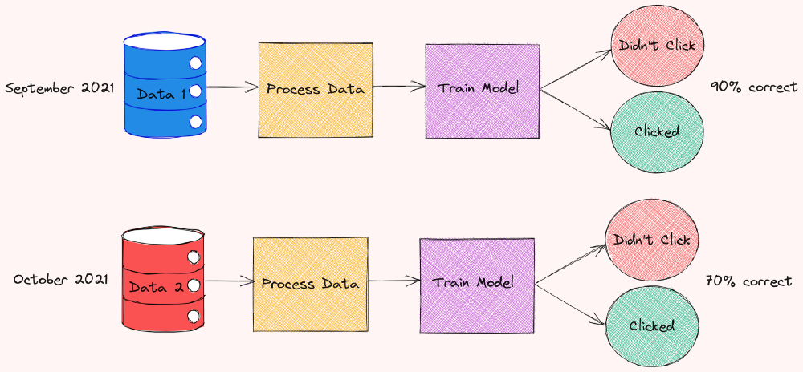
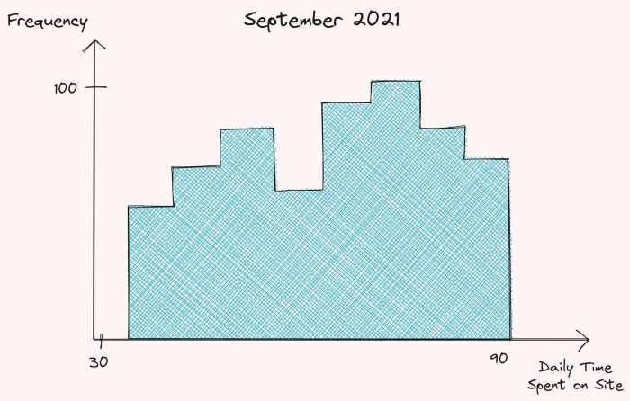
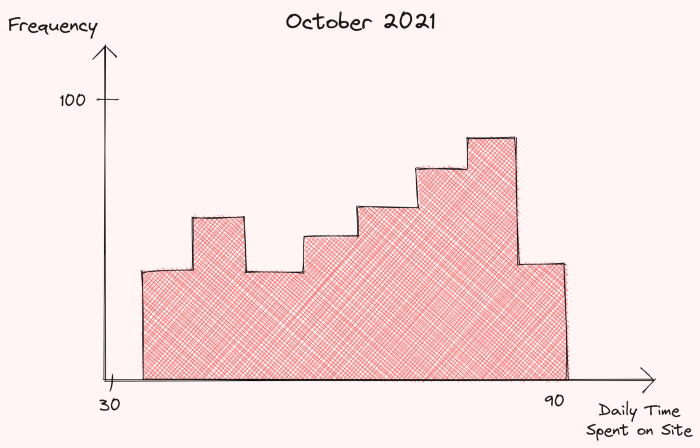
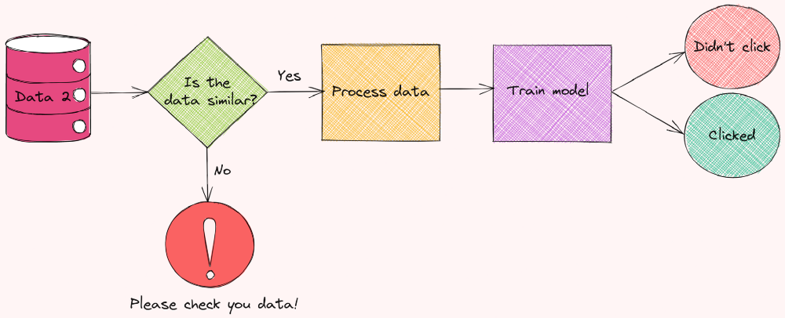

# Testando os dados

Suponha que uma empresa esteja treinando um modelo de <i>machine learning</i> para prever se um usuário clicará ou não em um anúncio usando dados coletados dos usuários. Em setembro de 2021, o modelo treinado conseguiu uma acurácia de 90% nas predições! 

Porém, em outubro do mesmo ano, o mesmo modelo teve sua acurácia reduzida para 70%. O que aconteceu?

A principal suspeita é de que a performance do modelo pode ter sido degradada por alterações nos dados de entrada. Decide-se, então, comparar a distribuição do tempo que os usuários gastaram por dia no site em setembro de 2021 e outubro de 2021. 

Obtém-se um <i>insight</i> valioso aqui! Há uma diferença significativa na distribuição do tempo gasto por dia entre os meses comparados.

Como o tempo gasto por dia no site é uma das variáveis preditoras mais importantes no modelo, a queda na distribuição dela gera uma degradação na performance do modelo.

Ao invés de verificar manualmente se há uma alteração na distribuição dos dados todos os meses, há alguma forma automatizada de realizar essa checagem de alteração na distribuição dos dados de entrada antes mesmo deles serem inseridos no modelo?

Neste capítulo serão apresentadas algumas bibliotecas para validação de dados em Python.