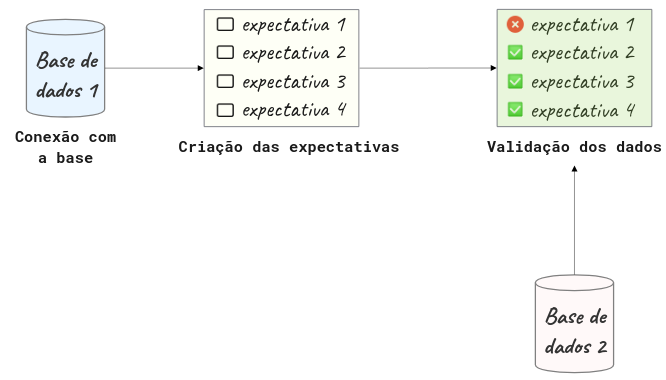

## Great Expectations: saiba sempre o que esperar dos seus dados

### O que é o Great Expectations?

Great Expectations é uma biblioteca referência de Python que permite você validar, documentar e checar dados para garantir que eles estão conforme esperado.

O Great Expectations passa por uma lista de checagem para garantir que os dados passem por todos os testes antes de serem utilizados.


Há inúmeras ferramentas disponíveis que permitem criar validações para os dados. Porém, a autora afirma gostar do Great Expectations pelos seguintes motivos:

- **Cria automaticamente um pipeline de testes para os dados:** criar um pipeline de testes compreensivos para os dados pode ser uma tarefa árdua. O Great Expectations elimina essa complexidade sugerindo alguns testes baseado nas características da própria base de dados.


- **Cria suas validações e configura a sua fonte de dados através de Jupyter Notebooks:** Para algumas pessoas pode ser difícil criar validações de dados usando arquivos JSON. Great Expectations facilita a criação destas validações usando Jupyter Notebooks!

- **Cria uma documentação de dados:** O Great Expectations também cria uma documentação de fácil leitura que permite entender os dados e as validações eficientemente.


- **Possui integração simples com ferramentas que usam DAG:** O Great Expections se integra facilmente com ferramentas baseadas em DAG como o [Apache Airflow](https://airflow.apache.org/), [dbt](https://www.getdbt.com/), [Prefect](https://www.prefect.io/), [Dagster](https://github.com/dagster-io/dagster), [Kedro](https://github.com/quantumblacklabs/kedro), dentre outras.

Nesta seção: 
- Será apresentada uma introdução ao Great Expectations.
- Também serão respondidas algumas perguntas sobre esta ferramenta. 

Para instalar o Great Expectations, rode:

```bash
pip install great_expectations
```
### Primeiros passos

#### Criando um contexto de dados (Data Context)

O chamado contexto de dados, ou Data Context em inglês, gerencia a configuração do seu projeto. Para criar um Data Context usando a API versão 3, rode:

```bash
$ great_expectations --v3-api init
```

E um novo diretório com o conteúdo da imagem abaixo será gerado no seu diretório atual!


Abaixo há uma explicação de cada um destes diretórios e arquivos:

- O arquivo `great_expectations.yml` contém as principais configurações da implementação atual;
- O diretório `expectations` armazena todas as validações como arquivos JSON;
- O diretório `plugins` armazena os códigos para quaisquer plugins que possam eventualmente existir;
- O diretório `uncommited` contém arquivos que não deveriam estar no controle de versionamento.

#### Fluxo do Great Expectations

O Great Expectations geralmente inclui 3 etapas: conectar à base de dados, criar as validações e validar os dados:



Nas seções seguintes serão abordadas cada uma destas etapas.

### Conectando à base de dados


Como demonstração, optou-se por dividir o dataset [advertising dataset](https://www.kaggle.com/datasets/joaovitorsilva/advertising-dataset), baixado do Kaggle , em dois datasets: `first_data.csv` e `second_data.csv`, nos quais:

- `first_data.csv` contém dados de janeiro de 2016 a abril de 2016;
- `second_data.csv` contém dados de maio de 2016 a julho de 2016.

Estes datasets estão armazenados no diretório `data`.


Para conectar à fonte de dados, rode:

```bash
$ great_expectations --v3-api datasource new
```

E você será perguntado sobre como quer configurar sua conexão:


Há a possibilidade de conectar o Great Expectations a arquivos locais ou a um banco de dados. Aqui foi feita as seguintes escolhas:

- Conectar a arquivos no nosso sistema operacional;
- processar os dados com o framework Pandas;
- especificar o diretório `data` como o que contém os datasets que o Great Expectations irá considerar para análise.

Após responder a estas perguntas, um Jupyter Notebook será aberto de forma automática! Este notebook permite configurar a nova fonte de dados, Datasource. Este Datasource dirá ao Great Expectations onde estão os dados e como se conectar a eles.


Por padrão, o Great Expectations cria o Jupyter Notebook no seguinte caminho: `great_expectations/uncommitted/datasource_new.ipynb`

Neste notebook, é possível especificar o nome do Datasource editando o valor da variável `datasource-name`:

```python
datasource_name = "first_data"
```

O trecho de código abaixo permite criar e customizar as configurações no Datasource:

```python
example_yaml = f"""
name: {datasource_name}
class_name: Datasource
execution_engine:
  class_name: PandasExecutionEngine
data_connectors:
  default_inferred_data_connector_name:
    class_name: InferredAssetFilesystemDataConnector
    base_directory: ../data
    default_regex:
      group_names: 
        - data_asset_name
      pattern: (.*)
  default_runtime_data_connector_name:
    class_name: RuntimeDataConnector
    batch_identifiers:
      - default_identifier_name
"""
```

Nas configurações acima, a classe `InferredAssetFilesystemDataConnector` irá procurar por arquivos no diretório fornecido utilizando expressões regulares.

Por exemplo, como `first_data` e `second_data` estão no diretório `data`, a classe `InferredAssetFilesystemDataConnector` irá detectá-los e conectar-se a eles.

```python
context.test_yaml_config(yaml_config=example_yaml)
```

```python
Available data_asset_names (2 of 2):   
    first_data.csv (1 of 1): ['first_data.csv']   
    second_data.csv (1 of 1): ['second_data.csv']
```

Após executar todas as células do notebook, a configuração do seu Datasource será adicionada ao `great_expectations.yml`!

[Neste link](https://legacy.docs.greatexpectations.io/en/latest/guides/how_to_guides/configuring_datasources.html) é possível ver outras formas de conectar a outras fontes.

### Criando a primeira validação


Agora que vem uma das partes mais empolgantes: criar as primeiras validações! A próxima etapa é criar uma nova Expectation Suite. Uma Expectation Suite é uma coleção de validações. Para criar uma nova Expectation Suite, rode:

```bash
$ great_expectations --v3-api suite new
```


É possível criar as validações de forma manual ou automática utilizando uma amostra do conjunto de dados. Aqui, deseja-se criar uma validação automática considerando o arquivo `first_data.csv`.

Depois de responder a todas as perguntas, um outro Jupyter Notebook será criado automaticamente. Neste outro Notebook, é possível selecionar colunas e outros fatores que sejam relevnates na análise, e deixar o profiler do Great Expectations sugerir algumas validações.


O novo Notebook pode ser encontrado em `great_expectations/uncommitted`.

A primeira célula deste Notebook carregará os dados especificados em Datasource. Aqui é um ponto importante, pois é possível visualizar e checar algumas características do conjunto de dados.

```python
validator.head(n_rows=10, fetch_all=False)
```

O Great Expectations também oferece um filtro de colunas que serão ignoradas por ele, ou seja, não será criada nenhuma validação para elas.

Por estar usando um dataset diferente do livro original, houve a necessidade de incluir o separador ponto-e-vírgula no Notebook, na primeira célula, variável `batch_request` foi acrescida da seguinte configuração:

```python
batch_request = {
    "datasource_name": "first_data",
    "data_connector_name": "default_inferred_data_connector_name",
    "data_asset_name": "first_data.csv",
    "limit": 1000,
    "batch_spec_passthrough": {"reader_options": {"sep": ";"}} # Configuração do separador de colunas acrescida!
}
```

A solução foi encontrada neste [issue](https://github.com/great-expectations/great_expectations/issues/2038) do repositório oficial do Great Expectations no GitHub.

Depois de rodar o restante do Notebook, um relatório similar ao mostrado abaixo será criado!


Existe ainda a possibilidade de editar as validações criadas pelo Grat Expectations. Tudo bem! Basta digitar:

```bash
$ great_expectations --v3-api suite edit first_data.csv.warning
```

`first_data.csv.warning` é o nome da Expectation Suite. Depois de rodar o comando acima, um outro Notebook será aberto e fornece a possibilidade de editar a Expectation Suite.

...tradução ainda em andamento!