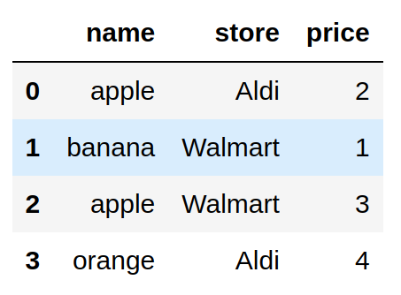

[](https://github.com/khuyentran1401/Data-science/blob/master/data_science_tools/pandera_example/pandera.ipynb) 

## Valide Seu Pandas DataFrame com Pandera

### Motivação

Na seção anterior, mostrei como usar o Great Expectations para validar seus dados.

Embora o Great Expectations forneça muitas ferramentas úteis, pode ser complicado criar um conjunto de validação com o Great Expectations. Para um pequeno projeto de ciência de dados, usar o Great Expectations pode ser um exagero.

É por isso que nesta seção, aprenderemos sobre o [Pandera](https://pandera.readthedocs.io/en/stable/), uma biblioteca Python simples para validar um DataFrame pandas.

Para instalar o Pandera, digite:

```bash
pip install pandera
```

### Introdução

Para aprender como o Pandera funciona, vamos começar criando um simples conjunto de dados:

```python
import pandas as pd

fruits = pd.DataFrame(
    {
        "name": ["apple", "banana", "apple", "orange"],
        "store": ["Aldi", "Walmart", "Walmart", "Aldi"],
        "price": [2, 1, 3, 4],
    }
)

fruits
```



Imagine este cenário. Seu gerente lhe diz que só pode haver certas frutas e lojas no conjunto de dados e o preço deve ser menor que 4.

```python
available_fruits = ["apple", "banana", "orange"]
nearby_stores = ["Aldi", "Walmart"]
```

Para garantir que seus dados sigam tais condições, verificar seus dados manualmente pode tomar muito tempo, especialmente quando o conjunto é grande. 
Existe uma maneira de automatizar esse processo?

É aí que o Pandera se torna útil. Especificamente, nós:

- Criaremos vários testes para todo o conjunto de dados usando `DataFrameSchema`;
- Criaremos vários testes para cada coluna usando `Column`;
- Especificaremos o tipo de teste usando `Check`.


```python
import pandera as pa
from pandera import Column, Check

schema = pa.DataFrameSchema(
    {
        "name": Column(str, Check.isin(available_fruits)),
        "store": Column(str, Check.isin(nearby_stores)),
        "price": Column(int, Check.less_than(4)),
    }
)
schema.validate(fruits)
```

```bash
SchemaError: <Schema Column(name=price, type=DataType(int64))> failed element-wise validator 0:
<Check less_than: less_than(4)>
failure cases:
   index  failure_case
0      3             4
```

No código acima:

- `"name": Column(str, Check.isin(available_fruits))` verifica se a coluna `name` é do tipo string e se todos os valores da coluna `name` estão dentro de uma lista especificada;
- `"price": Column(int, Check.less_than(4))` verifica se todos os valores na coluna `price` são do tipo `int` e são menores que 4;
- Como nem todos os valores na coluna `price` são menores que 4, o teste falha.

Encontre outros métodos de verificações `Checks` integrados [aqui](https://pandera.readthedocs.io/en/stable/reference/generated/pandera.checks.Check.html#pandera-checks-check).

### Checks Customizados

Também podemos criar verificações personalizadas usando `lambda` . No código abaixo, `Check(lambda price: sum(price) < 20)` verifica se a soma da coluna `price` é menor que 20.

```python
schema = pa.DataFrameSchema(
    {
        "name": Column(str, Check.isin(available_fruits)),
        "store": Column(str, Check.isin(nearby_stores)),
        "price": Column(
            int, [Check.less_than(5), Check(lambda price: sum(price) < 20)]
        ),
    }
)
schema.validate(fruits)
```

### Model de Schema

Quando nossos testes são complicados, usar <i>dataclass</i> pode fazer nossos testes parecerem muito mais limpos do que usar um dicionário. Felizmente, o Pandera também nos permite criar testes usando uma classe de dados em vez de um dicionário.

```python
from pandera.typing import Series

class Schema(pa.SchemaModel):
    name: Series[str] = pa.Field(isin=available_fruits)
    store: Series[str] = pa.Field(isin=nearby_stores)
    price: Series[int] = pa.Field(le=5)

    @pa.check("price")
    def price_sum_lt_20(cls, price: Series[int]) -> Series[bool]:
        return sum(price) < 20

Schema.validate(fruits)
```

### Validação com Decorator

#### Check Input (Entrada)

Agora que sabemos como criar testes para nossos dados, como podemos usá-los para testar a entrada de nossa função? Uma abordagem simples é adicionar `schema.validate(input)` dentro de uma função.
```python
fruits = pd.DataFrame(
    {
        "name": ["apple", "banana", "apple", "orange"],
        "store": ["Aldi", "Walmart", "Walmart", "Aldi"],
        "price": [2, 1, 3, 4],
    }
)

schema = pa.DataFrameSchema(
    {
        "name": Column(str, Check.isin(available_fruits)),
        "store": Column(str, Check.isin(nearby_stores)),
        "price": Column(int, Check.less_than(5)),
    }
)


def get_total_price(fruits: pd.DataFrame, schema: pa.DataFrameSchema) -> int:
    validated = schema.validate(fruits)
    return validated["price"].sum()


get_total_price(fruits, schema)
```

No entanto, essa abordagem dificulta o teste de nossa função. Como o argumento de `get_total_price` requer ambos `fruits` e `schema`, precisamos incluir esses dois argumentos no teste:
```python
def test_get_total_price():
    fruits = pd.DataFrame({'name': ['apple', 'banana'], 'store': ['Aldi', 'Walmart'], 'price': [1, 2]})
    
    # Precisa incluir o schema na unidade de teste
    schema = pa.DataFrameSchema(
        {
            "name": Column(str, Check.isin(available_fruits)),
            "store": Column(str, Check.isin(nearby_stores)),
            "price": Column(int, Check.less_than(5)),
        }
    )
    assert get_total_price(fruits, schema) == 3
```

`test_get_total_price` testa os dados e a função. Porque um teste de unidade deve testar apenas uma coisa, incluir validação de dados dentro de uma função não é o ideal.

O Pandera fornece uma solução para isso com o decorator `check_input`. O argumento deste decorador é usado para validar a entrada da função.
```python
from pandera import check_input

@check_input(schema)
def get_total_price(fruits: pd.DataFrame) -> int:
    return fruits.price.sum()

get_total_price(fruits)
```

Se a entrada não for válida, o Pandera gerará um erro antes que a entrada seja processada por sua função:
```python
fruits = pd.DataFrame(
    {
        "name": ["apple", "banana", "apple", "orange"],
        "store": ["Aldi", "Walmart", "Walmart", "Aldi"],
        "price": ["2", "1", "3", "4"],
    }
)

@check_input(schema)
def get_total_price(fruits: pd.DataFrame) -> int:
    return fruits.price.sum()

get_total_price(fruits)
```

```bash
SchemaError: error in check_input decorator of function 'get_total_price': expected series 'price' to have type int64, got object
```

Validar os dados antes do processamento é muito bom, pois nos **impede** de **perder uma quantidade significativa de tempo no processamento dos dados**.

#### Check Output (Saída)

Também podemos usar o decorator `check_output` do Pandera para verificar a saída de uma função:
```python
from pandera import check_output

fruits_nearby = pd.DataFrame(
    {
        "name": ["apple", "banana", "apple", "orange"],
        "store": ["Aldi", "Walmart", "Walmart", "Aldi"],
        "price": [2, 1, 3, 4],
    }
)

fruits_faraway = pd.DataFrame(
    {
        "name": ["apple", "banana", "apple", "orange"],
        "store": ["Whole Foods", "Whole Foods", "Schnucks", "Schnucks"],
        "price": [3, 2, 4, 5],
    }
)

out_schema = pa.DataFrameSchema(
    {"store": Column(str, Check.isin(["Aldi", "Walmart", "Whole Foods", "Schnucks"]))}
)


@check_output(out_schema)
def combine_fruits(fruits_nearby: pd.DataFrame, fruits_faraway: pd.DataFrame) -> pd.DataFrame:
    fruits = pd.concat([fruits_nearby, fruits_faraway])
    return fruits


combine_fruits(fruits_nearby, fruits_faraway)
```

#### Check Ambos Inputs e Outputs (Entradas e Saídas)

Agora você pode se perguntar, existe uma maneira de verificar as entradas e saídas? Podemos fazer isso usando o decorator `check_io` :
```python
from pandera import check_io

in_schema = pa.DataFrameSchema({"store": Column(str)})

out_schema = pa.DataFrameSchema(
    {"store": Column(str, Check.isin(["Aldi", "Walmart", "Whole Foods", "Schnucks"]))}
)


@check_io(fruits_nearby=in_schema, fruits_faraway=in_schema, out=out_schema)
def combine_fruits(fruits_nearby: pd.DataFrame, fruits_faraway: pd.DataFrame) -> pd.DataFrame:
    fruits = pd.concat([fruits_nearby, fruits_faraway])
    return fruits


combine_fruits(fruits_nearby, fruits_faraway)
```

### Outros Argumentos para Validação de Coluna

#### Trabalhando com Valores Nulos

Por padrão, o Pandera gerará um erro se houver valores nulos em uma coluna que estamos testando. Se valores nulos forem aceitáveis, adicione `nullable=True` à nossa classe `Column`:
```python
import numpy as np

fruits = fruits = pd.DataFrame(
    {
        "name": ["apple", "banana", "apple", "orange"],
        "store": ["Aldi", "Walmart", "Walmart", np.nan],
        "price": [2, 1, 3, 4],
    }
)

schema = pa.DataFrameSchema(
    {
        "name": Column(str, Check.isin(available_fruits)),
        "store": Column(str, Check.isin(nearby_stores), nullable=True),
        "price": Column(int, Check.less_than(5)),
    }
)
schema.validate(fruits)
```

#### Trabalhando com Dados Duplicados

Por padrão, dados duplicados são aceitáveis. Para gerar um erro quando houver duplicatas, use `allow_duplicates=False`:

```python
schema = pa.DataFrameSchema(
    {
        "name": Column(str, Check.isin(available_fruits)),
        "store": Column(
            str, Check.isin(nearby_stores), nullable=True, allow_duplicates=False
        ),
        "price": Column(int, Check.less_than(5)),
    }
)
schema.validate(fruits)
```

```bash
SchemaError: series 'store' contains duplicate values: {2: 'Walmart'}
```

#### Converta Tipos de Dados

`coerce=True` altera o tipo de dados de uma coluna se seu tipo de dados não satisfizer a condição de teste.

No código abaixo, o tipo de dados de preço é alterado de inteiro para string.
```python
fruits = pd.DataFrame(
    {
        "name": ["apple", "banana", "apple", "orange"],
        "store": ["Aldi", "Walmart", "Walmart", "Aldi"],
        "price": [2, 1, 3, 4],
    }
)

schema = pa.DataFrameSchema({"price": Column(str, coerce=True)})
validated = schema.validate(fruits)
validated.dtypes
```

```bash
name     object
store    object
price    object
dtype: object
```

#### Padrões de correspondência

E se quisermos alterar todas as colunas que começam com a palavra `store`?
```python
favorite_stores = ["Aldi", "Walmart", "Whole Foods", "Schnucks"]

fruits = pd.DataFrame(
    {
        "name": ["apple", "banana", "apple", "orange"],
        "store_nearby": ["Aldi", "Walmart", "Walmart", "Aldi"],
        "store_far": ["Whole Foods", "Schnucks", "Whole Foods", "Schnucks"],
    }
)
```

O Pandera nos permite aplicar as mesmas verificações em várias colunas que compartilham um determinado padrão adicionando `regex=True`:
```python
schema = pa.DataFrameSchema(
    {
        "name": Column(str, Check.isin(available_fruits)),
        "store_+": Column(str, Check.isin(favorite_stores), regex=True),
    }
)
schema.validate(fruits)
```

### Exporte e Carregue de um Arquivo YAML

### Exportar para YAML

Usar um arquivo YAML é uma maneira interessante de mostrar seus testes para colegas que não conhecem Python. Podemos manter um registro de todas as validações em um arquivo YAML usando `schema.to_yaml()`:
```python
from pathlib import Path

# Cria um objeto YAML
yaml_schema = schema.to_yaml()

# Salva em um arquivo
f = Path("schema.yml")
f.touch()
f.write_text(yaml_schema)
```

O `schema.yml` ficará parecido com o abaixo:
```yaml
schema_type: dataframe
version: 0.7.0
columns:
  name:
    dtype: str
    nullable: false
    checks:
      isin:
      - apple
      - banana
      - orange
    allow_duplicates: true
    coerce: false
    required: true
    regex: false
  store:
    dtype: str
    nullable: true
    checks:
      isin:
      - Aldi
      - Walmart
    allow_duplicates: false
    coerce: false
    required: true
    regex: false
  price:
    dtype: int64
    nullable: false
    checks:
      less_than: 5
    allow_duplicates: true
    coerce: false
    required: true
    regex: false
checks: null
index: null
coerce: false
strict: false
```

### Carregar de Arquivo YAML

Para carregar de um arquivo YAML, basta usar `pa.io.from_yaml(yaml_schema)` :
```python
with f.open() as file:
    yaml_schema = file.read()

schema = pa.io.from_yaml(yaml_schema)
```
