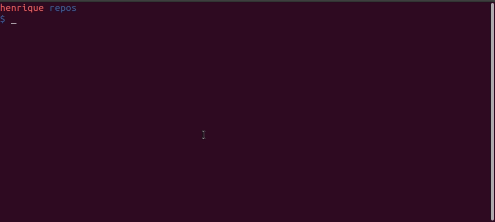
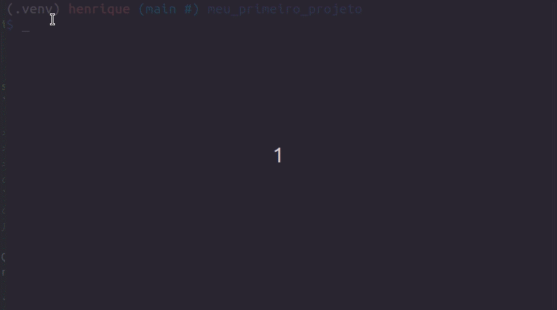

[](https://github.com/HenriqueAJNB/data-science-escalavel/tree/main/book)

## Como estruturar seu projeto de ciência de dados para aumentar a legibilidade e transparência

### Motivação

É importante estruturar o seu projeto de ciência de dados baseado em algum padrão para que seus colegas de trabalho consigam facilmente manter e modificar o projeto.


Mas qual tipo de padrão você deve seguir? Não seria ideal se pudessemos criar uma estrutura a partir de um modelo padrão (template)?

Existem alguns excelentes templates para projetos de ciência de dados, mas eles demonstram inexistência de algumas boas práticas como testes, configurações e formatação do código.

Por este motivo, a autora original do livro, Khuyen Tran, criou um repositório chamado [data-science-template](https://github.com/khuyentran1401/data-science-template/blob/master/README.md). Este repositório é resultado de anos de experiência dela refinando as melhores práicas para estruturar um projeto, deixando-o com maior reprodutibilidade e manutenabilidade.

Nesta seção iremos aprender a usar esse template para incporporar as melhores práticas ao fluxo de ciência de dados.

### Mão na massa!

Para fazer download do template, comece instalando o [cookiecutter](https://github.com/cookiecutter/cookiecutter):

```bash
pip install cookiecutter
```

Crie um projeto baseado no template:

```bash
cookiecutter https://github.com/khuyentran1401/data-science-template
```

..., e você será questionado de alguns detalhes do seu projeto, como:
- Nome
- Autor
- Versão compatível do Python



Neste momento uma pasta com o nome fornecido acima será criada, e ela terá a seguinte estrutura:


As ferramentas usadas nesse template são:

- [Poetry](https://python-poetry.org/): gerenciamento de pacotes e ambientes virtuais.
- [hydra](https://hydra.cc/docs/intro/): gerenciamento de arquivos de configuração.
- plugins do [pre-commit](https://pre-commit.com/): automação na formatação e revisão do código.
- [DVC](https://dvc.org/): versionamento de dados e experimentos.
- [pdoc](https://pdoc.dev/): criação de documentação automática para a API do seu projeto.

Nas próximas seções, nós vamos aprender as funcionalidades destas ferramentas e arquivos.

### Dependências e ambiente virtual

Este projeto usa o [Poetry](https://python-poetry.org/) no lugar do `pip` para gerenciar as dependências. O motivo é porque o Poetry nos permite:

- Separar as dependências principais das dependências indiretas em dois arquivos diferentes, ao invés de colocar todas elas em um único arquivo `requirements.txt`.
- Criar arquivos de dependência mais legíveis.
- Remover todas as dependências indiretas ao remover um pacote.
- Evitar instalar novos pacotes que são conflitantes com aqueles pré-existentes.

As instruções de instalação do Poetry está neste [link](https://python-poetry.org/docs/#installation). Todas as dependências principais do projeto estão definidas no arquivo `pyproject.toml`. Para instalar todas as dependências, basta rodar no terminal:

```bash
poetry install
```

Para adicionar um novo pacote do repositório PyPI, rode:

```bash
poetry add <nome-do-pacote>
```

Para remover um pacote:

```bash
poetry remove <nome-do-pacote>
```

### Makefile

O arquivo Makefile permite criar atalhos pequenos e legíveis para uma série de comandos. Você pode usar o Makefile para automatizar tarefas como, por exemplo, a preparação inicial do seu ambiente:

```Makefile
install: 
	@echo "Installing..."
	poetry install
	poetry run pre-commit install

activate:
	@echo "Activating virtual environment"
	poetry shell

initialize_git:
  @echo "Initialize git"
	git init 

setup: initialize_git install
```

> **Comentário a parte do livro original:**
>
> Embora a autora não tenho mencionado no livro original, existem alternativas não oficiais para realizar essas automações com o `make` no Windows, pois o `make` não é nativo deste sistema operacional. Em contrapartida, existe o `just` que funciona de forma equivalente ao `make` e também funciona no Windows.

Quando qualquer pessoa pegar o projeto pela primeira vez, basta rodar os comandos abaixo para preparar todo o ambiente do projeto:

```bash
make activate
make setup
```



### Código e testes

Todos os scripts Python são armazenados dentro da pasta `src`


> **Comentário a parte do livro original:**
>
> Eu particularmente não chamaria a pasta principal de `src`, pois não é o padrão da linguagem Python. Por padrão, o pacote Python principal recebe o mesmo nome do projeto. Este padrão `src` muito provavelmente é proveniente de outras linguagens de programação.

Todos os arquivos de testes estão armazenados no diretório `tests`. Ele deve ser um espelho do diretório `src` onde cada arquivo começa com o nome `test` seguido do nome do arquivo sendo testado.

