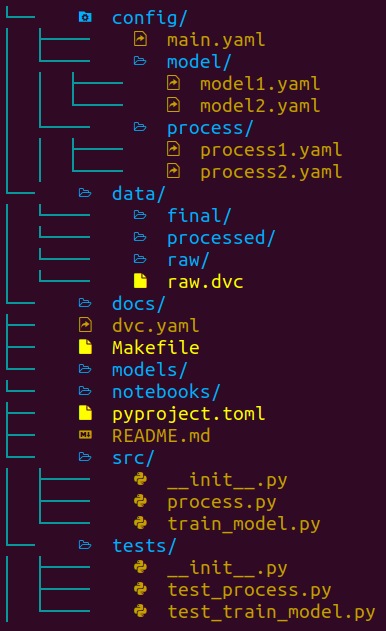
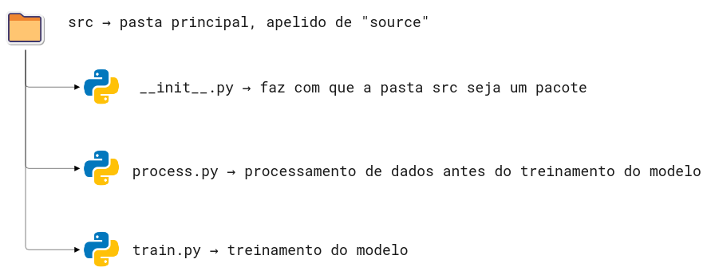

[](https://github.com/HenriqueAJNB/data-science-escalavel/tree/main/book)

<div style="text-align: justify">

## Como estruturar seu projeto de ciência de dados para aumentar a legibilidade e transparência

### Motivação

É importante estruturar o seu projeto de ciência de dados baseado em algum padrão para que seus colegas de trabalho consigam facilmente manter e modificar o projeto.


Mas qual tipo de padrão você deve seguir? Não seria ideal se pudessemos criar uma estrutura a partir de um modelo padrão (template)?

Existem alguns excelentes templates para projetos de ciência de dados, mas eles demonstram inexistência de algumas boas práticas como testes, configurações e formatação do código.

Por este motivo, a autora original do livro, Khuyen Tran, criou um repositório chamado [data-science-template](https://github.com/khuyentran1401/data-science-template/blob/master/README.md). Este repositório é resultado de anos de experiência dela refinando as melhores práicas para estruturar um projeto, deixando-o com maior reprodutibilidade e manutenabilidade.

Nesta seção iremos aprender a usar esse template para incporporar as melhores práticas ao fluxo de ciência de dados.

### Mão na massa!

Para fazer download do template, comece instalando o [cookiecutter](https://github.com/cookiecutter/cookiecutter):

```bash
pip install cookiecutter
```

Crie um projeto baseado no template:

```bash
cookiecutter https://github.com/khuyentran1401/data-science-template
```

..., e você será questionado de alguns detalhes do seu projeto, como:
- Nome
- Autor
- Versão compatível do Python


Neste momento uma pasta com o nome fornecido acima será criada, e ela terá a seguinte estrutura:




As ferramentas usadas nesse template são:

- [Poetry](https://python-poetry.org/): gerenciamento de pacotes e ambientes virtuais.
- [hydra](https://hydra.cc/docs/intro/): gerenciamento de arquivos de configuração.
- plugins do [pre-commit](https://pre-commit.com/): automação na formatação e revisão do código.
- [DVC](https://dvc.org/): versionamento de dados e experimentos.
- [pdoc](https://pdoc.dev/): criação de documentação automática para a API do seu projeto.

Nas próximas seções, nós vamos aprender as funcionalidades destas ferramentas e arquivos.

### Dependências e ambiente virtual

Este projeto usa o [Poetry](https://python-poetry.org/) no lugar do `pip` para gerenciar as dependências. O motivo é porque o Poetry nos permite:

- Separar as dependências principais das dependências indiretas em dois arquivos diferentes, ao invés de colocar todas elas em um único arquivo `requirements.txt`.
- Criar arquivos de dependência mais legíveis.
- Remover todas as dependências indiretas ao remover um pacote.
- Evitar instalar novos pacotes que são conflitantes com aqueles pré-existentes.

As instruções de instalação do Poetry está neste [link](https://python-poetry.org/docs/#installation). Todas as dependências principais do projeto estão definidas no arquivo `pyproject.toml`. Para instalar todas as dependências, basta rodar no terminal:

```bash
poetry install
```

Para adicionar um novo pacote do repositório PyPI, rode:

```bash
poetry add <nome-do-pacote>
```

Para remover um pacote:

```bash
poetry remove <nome-do-pacote>
```

### Makefile

O arquivo Makefile permite criar atalhos pequenos e legíveis para uma série de comandos. Você pode usar o Makefile para automatizar tarefas como, por exemplo, a preparação inicial do seu ambiente:

```Makefile
install: 
	@echo "Installing..."
	poetry install
	poetry run pre-commit install

activate:
	@echo "Activating virtual environment"
	poetry shell

initialize_git:
  @echo "Initialize git"
	git init 

setup: initialize_git install
```

> **Comentário a parte do livro original:**
>
> Embora a autora não tenho mencionado no livro original, existem alternativas não oficiais para realizar essas automações com o `make` no Windows, pois o `make` não é nativo deste sistema operacional. Em contrapartida, existe o `just` que funciona de forma equivalente ao `make` e também funciona no Windows.

Quando qualquer pessoa pegar o projeto pela primeira vez, basta rodar os comandos abaixo para preparar todo o ambiente do projeto:

```bash
make activate
make setup
```


### Código e testes

Todos os scripts Python são armazenados dentro da pasta `src`



> **Comentário a parte do livro original:**
>
> Eu particularmente não chamaria a pasta principal de `src`, pois não é o padrão da linguagem Python. Por padrão, o pacote Python principal recebe o mesmo nome do projeto. Este padrão `src` muito provavelmente é proveniente de outras linguagens de programação.

Todos os arquivos de testes estão armazenados na pasta `tests`. Ela deve ser um espelho da pasta `src` onde cada arquivo começa com o nome `test` seguido do nome do arquivo sendo testado.


### Gerenciando arquivos de configurações com hydra

Um arquivo de configurações armazena todos os valores em um único arquivo, a fim de deixá-los separados e não escrevê-los diretamente no código. Neste template, todos os arquivos de configuração são armazenados na pasta `config`.


[Hydra](https://hydra.cc/docs/intro/) é um pacote da linguagem Python que permite acessar os parâmetros de configuração dos arquivos dentro de um script Python.

Por exemplo, se o seu `config/main.yaml` tiver o conteúdo abaixo:

```yaml
raw: 
  path: data/raw/sample.csv

processed:
  path: data/processed/processed.csv

final:
  path: data/final/final.csv
```

..., podemos acessar os valores nesse arquivo de configuração usando o decorador `@hydra.main` em uma função específica. Dentro da função, podemos acessar os valores em `processed` e `path` usando a notação de ponto: `config.processed.path`.


```python
"""
Este trecho de código demonstra de forma simples como acessar os parâmetros dentro da pasta config.
Autora do código: Khuyen Tran
Autor da tradução: Henrique Branco
"""

import hydra
from omegaconf import DictConfig
from hydra.utils import to_absolute_path as abspath

@hydra.main(config_path="../config", config_name='main')
def process_data(config: DictConfig):
    """Função para processar os dados"""

    raw_path = abspath(config.raw.path)
    print(f"Processando os dados com {raw_path}")
    print(f"Colunas utilizadas: {config.process.use_columns}")

if __name__ == '__main__':
    process_data()
```

Vamos aprofundar em maiores detalhes na seção sobre configurações.

### Gerenciando modelos e dados com DVC

Todos os dados são armazenados na pasta `data`. Cada subpasta dentro de `data` armazena dados em diferentes estágios.


Todos os modelos são salvos na pasta models.

Sabendo que o *git* não é uma ferramenta propícia para versionamento de dados e arquivos binários (modelos), vamos usar o DVC - Data Version Control - para controlar o versionamento de nossos dados e modelos.

Começamos com especificando as etapas no arquivo `dvc.yaml`. Cada etapa representa um processamento específico de dados, incluindo a entrada (`deps`) e a saída (`outs`).

```yaml
stages:
  process_data:
    cmd: python src/process.py
    deps:
    - config/main.yaml
    - config/process
    - data/raw
    - src/process.py
    outs:
    - data/processed:
        persist: true
  train_model:
    cmd: python src/train_model.py
    deps:
    - config/main.yaml
    - config/model
    - data/processed
    - src/train_model.py
    outs:
    - data/final:
        persist: true
    - models:
        persist: true
```

Todas as pastas e arquivos abaixo de `outs` serão automaticamente rastreados e versionados pelo DVC.

Se você quiser executar as etapas definido em `stages`, basta rodar noo terminal

```bash
dvc repro
```

Fato interessante é que o DVC pula as etapas que não foram modificadas, e roda somente as etapas que foram alteradas, economizando tempo no processo de modelagem.


### Armazenando seus dados de forma remota

O maior benefício no uso do DVC está no fato de ser possível armazenar dados em diversas plataformas, incluindo os serviços em nuvem. Você pode armazenar seus dados no DagsHub, Google Drive, Amazon S3, Azure Blob Storage, Google Cloud Storage Aliyun OS, SSH, HDFS e HTTP.

```bash
dvc remote add -d remote <REMOTE-URL>
```

Depois de adicionar dados ao seu projeto local, você pode enviá-los para armazenamento remoto desta forma:
```bash
dvc push
```

Agora basta adicionar as outras informações ao git:
```bash
git add .
git commit -m 'mensagem de commit'
git push origin <BRANCH>
```

Vamos aprofundar em maiores detalhes sobre o DVC na seção sobre versionamento de dados.

### Encontrando bugs no seu código antes de commitar

Quando vamos commitar um código, precisanos nos certificar que:
- está bem formatado
- está organizado
- segue a padronização de estilo da PEP 8
- inclui documentações nas funções e classes (docstrings)

No entanto, pode ser muito entediante e propenso a erro checar todos esses critérios antes de commitar o código. Para isso, contamos com a ferramenta **pre-commit**, que permite identificar estes detalhes antes de commitar o código.

Você consegue adicionar diferentes plugins ao seu pipeline do pre-commit. Uma vez que você commitou, todo o projeto passara por estas checagens. Caso alguma delas falhe, nenhum código será commitado.


Neste template, usamos 5 diferentes plugins, especificados em `.pre-commit-config.yaml`. São deles:

- [black](https://black.readthedocs.io/en/stable/) - formata os scripts Python.
- [flake8](https://flake8.pycqa.org/en/latest/) - checa a aderência à PEP8.
- [isort](https://pycqa.github.io/isort/) - ordena as importações de forma automática.
- [mypy](http://mypy-lang.org/) - checa os tipos das variáveis de forma estática.
- [nbstrpout](https://github.com/kynan/nbstripout) - limpa o `.json` dos arquivos Jupyter Notebooks.

Para adicionar o pre-commit aos hooks do git, rode no terminal:

```bash
pre-commit install
```

A partir de agora, quando você der um `git commit`, seu código passara por todas as verificações e correções, de forma automática.


Vamos aprofundar em maiores detalhes sobre pre-commit na seção sobre formatação de código.

### Adicionando a documentação da API

Como um cientista de dados, assim como em qualquer outra profissão, sempre há o trabalho em equipe. Portanto, é importante criar uma boa documentação para o seu projeto.

Para criar a documentação da API do seu projeto baseado nas docstrings dos seus scripts Python, vamos rodar:

```bash
make docs_view
```

Saída:

```bash
Save the output to docs...
pdoc src --http localhost:8080
Starting pdoc server on localhost:8080
pdoc server ready at http://localhost:8080
```

A documentação estará disponível em http://localhost:8080.

Para salvar a saída da documentação em formato markdown:

```bash
make docs_save
```

### Conclusões

You have just learned how to structure your data science project using a data science template. This template means to be flexible. Feel free to adjust the project based on your applications.

Você acabou de aprender a estruturar um projeto de ciência de dados usando um template. Este template traz uma flexibilidade extrema. Sinta-se a vontade para ajustá-lo baseado nas suas próprias aplicações.

E também pode brincar a vontade com o template data-science-template da autora Khuyen Tran neste [link](https://github.com/khuyentran1401/data-science-template).

</div>